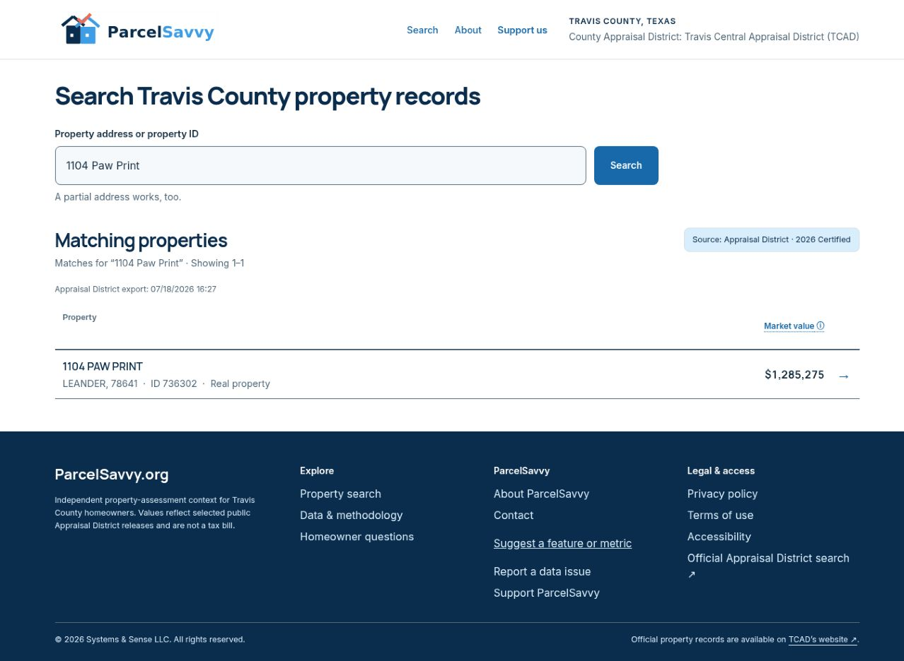
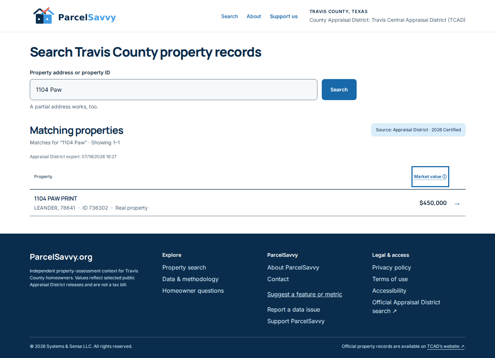
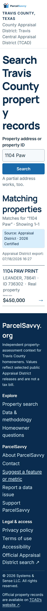

# PAR-5, PAR-6, PAR-8, PAR-7 implementation evidence

Date: September 19, 2026. Requested implementation order: PAR-5 → PAR-6 → PAR-8 → PAR-7.

Original base commit: `a05c1b4` (main); integrated QA infrastructure from main `88cc8ab`. Published branch: `codex/home-regression-par-5-6-8-7`.

## Publication status

Published in [PR #81](https://github.com/wlreich/PropertyTaxHelper/pull/81) after Wendy's explicit approval. Application/test commit: `2cdab228ec8a7afe363a1ef13ccb6cbe4f9d1e68`.

Initial [Property search checks run](https://github.com/wlreich/PropertyTaxHelper/actions/runs/35457173398) passed 57/66 browser checks. Failures exposed a real delayed-blur focus race, enlarged-footer overflow, and test navigation synchronization/hidden-mobile-header assumptions. Fixes guard the delayed blur callback against refocused input, let the footer reflow, await submitted query navigation and test the header link only at widths where it is displayed. Keeping the delay preserves the mobile submit target until the click completes. The original [Home page regression run](https://github.com/wlreich/PropertyTaxHelper/actions/runs/35457173435) passed before the eight new acceptance tests were added to that matrix.

Intermediate reruns: [Property search checks](https://github.com/wlreich/PropertyTaxHelper/actions/runs/35457717189), [Home page regression](https://github.com/wlreich/PropertyTaxHelper/actions/runs/35457717191). These intermediate runs passed the PAR-5, PAR-8 and PAR-7 cases, but caught a mobile submit-target regression from immediate blur and a missing navigation wait in the cleared-history test. Both were corrected in the application/test commit above.

Final verification: [Property search checks](https://github.com/wlreich/PropertyTaxHelper/actions/runs/35457984316), [Home page regression](https://github.com/wlreich/PropertyTaxHelper/actions/runs/35457984340). Both passed on `2cdab228`: 66/66 brand/browser checks and 78/78 home regression checks. Build, lint, TypeScript, 68 unit tests, 33 SQL tests and rendered-page smoke also passed.

## Baseline reproduction

Observed at https://property-tax-helper.vercel.app/ in cloud Chrome on September 19:

- Full address `1104 Paw Print, Leander, TX 78641` produced no suggestions and no submitted matches; `1104 Paw Print` returned 736302.
- Activating the lower search CTA left focus on its anchor instead of the input.
- Selecting 1102 Paw via keyboard opened 736303; browser Back returned a blank input.
- Data & methodology led to the introductory trust section instead of methodology content.
- Results header text was visibly misaligned and the footer arrow was orphaned.

Baseline deployed commit was not verified. The local base commit above must not be represented as the confirmed deployed build.

## Implemented changes

| Issue | Changes | Acceptance evidence |
| --- | --- | --- |
| PAR-5 | Shared contextual TX/Texas normalization at both server lookup boundaries; preserve city/ZIP constraints and legitimate Texas street names; inline trimmed blank validation; numeric-ID recovery guidance; service failures remain distinct. | Passed: variants/ID, negatives, typo, units, suggestions and keyboard submit, blank focus/no-request, query-specific guidance at 375/768/1440. Existing app-error/accessibility checks also passed. |
| PAR-6 | Input focus from all three home search-entry links; reduced-motion-aware scrolling; draft stored only in current history entry, including clear; close popup/reset selection on restoration. | Passed: keyboard/mouse selections, Back/Forward, in-app return, refresh, pagination, cleared history, delayed-response/clear races, keyboard and reduced-motion mobile-width behavior. |
| PAR-8 | Dedicated /methodology using existing InformationPage; both footer variants link there; verified source inventory, values/caps/exemptions, comparison assumptions, recorded vs inferred protest evidence, no tax-savings promises; home date scoped to certified export. | Passed: footer click-through and Back from home/results, sections/report link, axe and no overflow at 375/768/1440. Desktop/mobile screenshots reviewed. |
| PAR-7 | Align header text using the shared baseline; keep external arrow with final word while allowing the label to wrap; retain tooltip hit target. | Passed: text tops within 1 px, tooltip pointer/keyboard/Escape, grouped final word/arrow and no overflow across 320/375/390/768/1024/1363/1440, including 200% root font size. Currency alignment/focus and screenshots reviewed. |

## Executed checks

- `npm ci` in web: passed.
- `npm run verify --prefix web`: passed. Formatting, brand, lint, 68 unit tests, production build, TypeScript.
- `npm test --prefix tools/property-search`: 33/33 passed, including publication/privacy/access controls and new actual-SQL address regression.
- `node tools/property-search/render-smoke.mjs`: passed. Home, suggestions API, matching, pagination, profile, return, neighborhood, printable report, missing/invalid states, CSS, and leakage assertions.
- Follow-up lint and typecheck after browser-test refinements: passed.
- New parser/service tests validate both RPC inputs, blank no-request behavior, legitimate Texas street names and query-specific guidance.
- New SQL fixtures exercise both actual search functions with the specified address variants, exact ID, typo, units, numbered streets, and negative cases. Financial fixture values are synthetic.

### Read-only live database checks

The normalized strings below were passed to existing deployed search functions. This verifies the database behavior for the new parser output, not deployment of the new application code.

| Query | Submitted result IDs | Suggestion IDs |
| --- | --- | --- |
| 1104 Paw Print Leander 78641 | 736302 | 736302 |
| 1104 Paw Print Leander | 736302 | 736302 |
| 736302 | 736302 | 736302 |
| 1104 Paw Print Houston 77001 | none | none |
| 1104 Paw Print Leander 99999 | none | none |
| 1905 West 36th Street Unit B | 799047 | 799047 |
| 1905 W 36 St #B | 799047 | 799047 |
| 1104 Paw Prnit | 736302 | none, as expected for exact typeahead |

The local SQL test separately confirms the typo is returned with `match_mode=possible`.

## Repeatable browser suite

`web/tests/brand/home-regression.spec.ts` adds eight tests to the existing `npm run test:brand-browser` suite. The existing pull-request workflow installs Chromium and captures reports/screenshots. Tests cover real local SQL fixtures, controlled delayed suggestion responses, clear and supersession, query/history, page-two return, focus, methodology, tooltip, measured text alignment, wrapping/overflow, and 200% text enlargement. Configured projects use 375, 768 and 1440 CSS px with reduced motion; the layout test additionally checks 320, 390, 1024 and 1363 px.

The new tests have run in CI; the initial failures and reruns are recorded above. PR runs use Chromium at 375/768/1440. Firefox desktop and WebKit mobile-width projects are configured for main/nightly/manual runs but have not been verified on this branch. Responsive emulation is not real-device validation. Real iOS/Android browser and assistive-technology checks remain unavailable in this environment. No latency SLA is claimed.

The branch preview at https://property-tax-helper-git-codex-home-regressi-c0a98b-wlreich-3996.vercel.app redirects to Vercel sign-in. Manual branch-preview verification against live records is blocked in the current session; deployment protection was not changed. Fixture CI is independent of that restriction. Merge/deploy only after required checks pass under the repository's standing authorization.

## PAR-8 copy provenance and limits

- Read-only metadata from ready TCAD datasets: 2025 May 8 preliminary, July 3 interim (excluded as baseline), July 19 certified; 2026 April 2 preliminary and July 18 certified.
- Current public protest observations include dates April 29 and September 13, 2026, plus undated 2025/2026 supplements. These are observation/source dates, not protest event dates and not a universal valuation-current-through date.
- May 8 conflict exclusions and July 3 interim treatment verified against dataset valuation notes and `isPreliminaryBaseline`/history implementation.
- `docs/tcad-adjustment-method.md`, `web/src/lib/tcad-method.ts`, `property-adjustments.ts`, comparison UI and neighborhood/protest logic establish implemented formulas and limitations. No new model, sale prices or source values were invented.
- [Texas Comptroller: Valuing Property](https://comptroller.texas.gov/taxes/property-tax/valuing-property.php) and [Property Tax Exemptions](https://comptroller.texas.gov/taxes/property-tax/exemptions/) checked for definitions, homestead-limit qualification, exemption/taxable-value distinction.
- [TCAD official property search](https://traviscad.org/propertysearch/) checked. Internal reporting path already exists. External page availability was checked, not an end-to-end filing or record-correction process.

The inventory is explicitly dated September 19, 2026. Future ingestion should update that inventory and continue to show per-property source labels. Do not describe it as dynamically refreshed.

## Brand review

Uses existing logos, font system, semantic tokens, InformationPage and shared search controls. Keeps the approved home layout and compact result rows. Copy is homeowner-focused and distinguishes facts, inference, estimated inputs and taxes. No intentional brand exception. Automated brand, browser accessibility and responsive checks passed; desktop/mobile methodology and result/reflow screenshots reviewed. Real-device and assistive-technology checks remain blocked as described above.

## After screenshots

Captured in Chromium against the built app and synthetic SQL fixtures at http://127.0.0.1:3058, commit `539c28f`. The later focus/test synchronization correction does not change these styles. Fixture financial values are fictional.

All seven responsive widths and enlarged variants are available in the [CI screenshot artifact](https://github.com/wlreich/PropertyTaxHelper/actions/runs/35457717189/artifacts/10588624043), alongside methodology screenshots at 375/768/1440. Reviewed desktop and narrow/enlarged captures show aligned currency values, visible keyboard focus, wrapped footer labels, and no orphan arrow or clipped/overlapping text.
